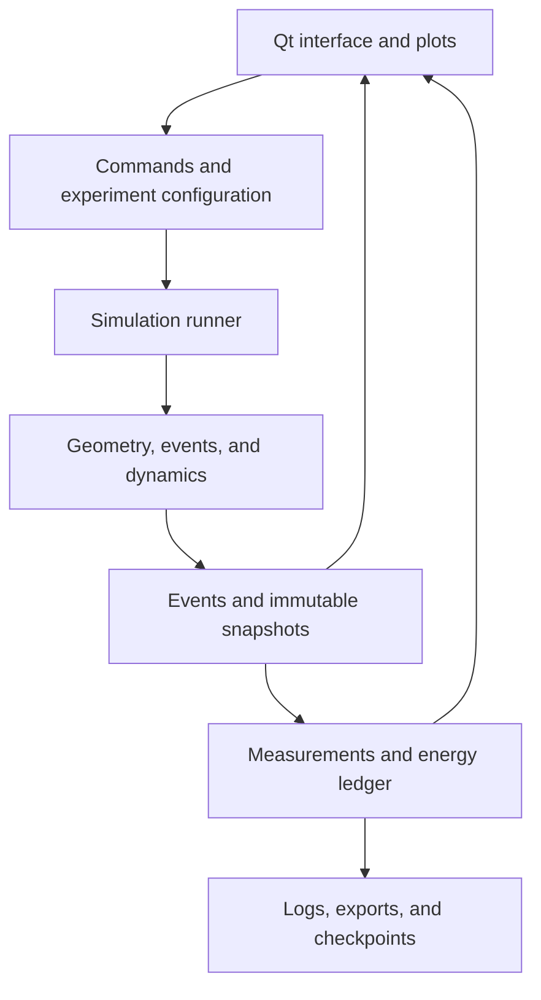

# Microscopic Thermodynamics Laboratory

## Implementation brief for the coding agent

**Design date:** 28 September 2026  
**Target:** an educational, aesthetically polished, extensible Ubuntu application  
**Preferred language:** Python, with compiled numerical kernels  
**Deliverable requested here:** a specification, not an implementation

Build one physical simulation engine supporting two principal demonstrations:

1. A mechanically coordinated Carnot-cycle apparatus, with a gas of colliding rotating equilateral triangles, a piston, a camshaft, thermal contacts, a flywheel, springs, and a load.
2. A chemical-potential laboratory containing small light discs and large mobile labyrinth hosts. Discs enter, collide within, and leave the hosts. Reversible association, occupancy, equilibrium, trapping kinetics, and selective permeability emerge from those trajectories.

The scene must be a simulation of individual objects. Never generate thermodynamic curves first and animate particles to match them. Pressure comes from impulses, heat from identified energy exchanges, and work from actual mechanical interactions. Analytical thermodynamics supplies comparisons and apparatus design parameters, not replacement dynamics.

Implement incrementally in the order below. Preserve a usable, verified application at each milestone. All experiments in this document belong to the eventual scope; items labeled extensions follow the validated core.

## 1. Decisions and priorities

| Question | Decision |
| --- | --- |
| Language | CPython, initially targeting Python 3.12 on Ubuntu 24.04 LTS; verify and lock an actually compatible dependency set when implementing. Support newer Ubuntu/Python combinations after testing. |
| Numerical acceleration | NumPy arrays and Numba `njit` kernels. Introduce a small C++/pybind11 extension only for demonstrated bottlenecks or robust geometry predicates that justify it. Keep the public API in Python. |
| Desktop UI | PySide6/Qt, a custom batched QPainter apparatus view, and PyQtGraph plots. Add an OpenGL rendering backend only if rendering benchmarks require it. |
| Physical model | Two-dimensional rigid bodies with hard, frictionless, elastic contacts by default. Three dynamic degrees of freedom per nonspherical free body. |
| Collision integration | Exact ballistic motion between events; continuous collision detection (CCD) and time-of-impact resolution for rotating shapes. |
| Mechanisms | Reduced-coordinate ideal mechanisms first, including a cam-linked piston. General joint graphs are a later extension. |
| Smooth conservative forces | Exact flows where available; a tested discrete-gradient energy-preserving method for low-dimensional nonlinear reduced mechanisms. A conventional structure-preserving comparison integrator remains available for convergence studies. |
| Thermostats | Local collision-based thermal boundaries with a verified equilibrium flux distribution. No whole-gas rescaling during a run. |
| Chemical model | Hard geometry first. Optional piecewise-constant binding energies and barriers are separate, explicitly labeled models. |
| Precision | Float64 physics, normalized units, deterministic event ordering. No `fastmath` in scientific kernels by default. |
| Conservation promise | Exact conservation in the mathematical isolated binary-impact map; floating-point and geometry tolerances in software. No claim of exact conservation for arbitrary constrained, driven, stochastic, or ambiguous multi-contact systems. |
| Performance priority | Correct collision chronology and energy accounting first; profile and optimize without changing those semantics. |

Do not use a game physics engine as the quantitative thermodynamics backend. Its collision geometry or algorithms may be useful references, but typical stabilization, damping, sleeping, penetration correction, and rotational CCD approximations are inappropriate defaults here. Box2D explicitly documents rotational impacts its TOI routine can miss [R4].

## 2. User experience and visual design

Use a single application with a scene library, shared controls, and shared instruments. The apparatus occupies approximately two thirds of the window; the remaining area contains two or three primary plots. Secondary diagnostics expand on demand.

### 2.1 Visual language

- Neutral dark or light instrument-style theme; amber hot contacts, blue cold contacts, pale insulating surfaces.
- Clearly distinguish material walls, thermal contacts, ideal mechanical linkages, and measurement overlays.
- Triangles carry an asymmetric small mark so rotation is visible despite threefold symmetry.
- Labyrinth interiors remain visible, with faint region shading and optional highlighted captured discs.
- Use colorblind-safe distinctions, labels, and shapes in addition to color.
- Optional trails, collision flashes, force arrows, region boundaries, and selected-particle histories. Keep them off by default in the polished view.
- Particle color may encode kinetic energy, species, or occupancy status. Include a legend and lock the color scale when comparing runs.
- Render the actual collision geometry. Cosmetic strokes must not make an aperture look open when its physical geometry is closed.
- No artificial attraction animation, springy collision deformation, or motion smoothing that conceals impacts.

### 2.2 Shared controls

Provide play/pause, reset to seed, step one collision, step a fixed physical duration, step one Carnot branch, playback speed, and experiment controls. Separate **simulation playback speed** from **physical engine speed**.

Changing playback speed alters how much physical time is computed per wall-clock second. Changing shaft speed changes the experiment. An overloaded computer should reduce achieved playback rate, never silently increase a physical integration step or skip collisions.

Support particle selection, zoom/pan, slow-motion replay, saved configurations, checkpoints, and headless batch runs. Allow parameter edits while paused; geometry, mass, and temperature edits are controlled interventions, not unrecorded changes to an equilibrium run. Explain when an edit requires reinitialization.

### 2.3 Guided and exploratory modes

Guided mode supplies short explanations synchronized with measured events. It must not claim equilibration merely because a timer has expired. Exploratory mode exposes parameters and all instruments. Both use the same physics.

Provide export of configuration, seed, summary JSON, sampled CSV, event logs, plots, and a rendered recording. Raw data and smoothing choices must be distinguishable.

## 3. Units, state, and geometric objects

Use dimensionless simulation units with reference length, mass, and energy set to one; typically set `k_B = 1`. Keep explicit dimensions in names and documentation. Temperatures and energy steps are then expressed in the same energy scale. Map to display units only at the interface.

For a free rigid body store center-of-mass position `x,y`, angle `theta`, linear velocity `vx,vy`, angular velocity `omega`, mass `m`, and central moment of inertia `I`. Geometry is defined in coordinates relative to the true center of mass. In 2D, `r × n = r_x*n_y - r_y*n_x` is a scalar.

### 3.1 Required bodies and shapes

| Object | Geometry and behavior |
| --- | --- |
| Small disc | Analytic circle. Omit spin for a smooth frictionless disc; normal impacts cannot thermalize its spin. |
| Equilateral triangle | Exact convex triangle, with optional explicitly documented rounded-corner variant for numerical comparison. For a uniform lamina of side `s`, `I = m*s²/12`. |
| Labyrinth | A rigid nonconvex compound solid with one to three nested open chambers, finite wall thickness, and explicit passage geometry. |
| Fixed wall | Finite segment or polygon with a material and thermal policy. Its support receives reaction momentum. |
| Piston | Massive guided body, with a gas-facing collision surface and an explicit mechanism connection. |
| Wheel/flywheel | Rotational inertia about a specified axle. Visible rim geometry is collidable only where intended. |
| Spring | Conservative element between defined anchors or reduced coordinates, with stored energy. |
| Load | Explicit work receiver: for example, an opposing shaft torque coupled to an energy counter. |
| Porous partition | A real repeated-gap structure, either fixed or a massive guided piston. |

Mass geometry and collision geometry can differ only through explicit configuration. For asymmetric labyrinths compute the center of mass and inertia, recenter the geometry, and retain the desired artwork transform separately. Never silently place the center of mass at the center of an incomplete ring.

### 3.2 Labyrinth construction

Begin with polygonal walls or a union of convex pieces. A per-host BVH accelerates queries. Use robust union boundary handling: seams between decomposition pieces are not physical edges, and buried faces must never generate contact impulses. A convex hull of the entire host is invalid because it fills the cavities.

All layers share one rigid-body state. Rigid attachments may be ideal constraints; if represented by material spokes, include those spokes in the collision geometry and ensure they do not seal the intended route. Validate the connectivity of the disc-center accessible space after expanding solid boundaries by the disc radius. Every nominally open route needs positive clearance greater than the numerical tolerance.

Expose aperture width, wall thickness, layer count, offsets, baffles, host mass, and inertia. Place mild asymmetry or baffles in recommended presets to permit off-center impulses and avoid persistent regular billiard trajectories. A truly centered circular arc transfers no torque about its center under frictionless normal impact; gaps and a displaced true center of mass can break that statement for an incomplete ring.

Do not promise that an extra layer always lengthens residence time: measure the actual geometry. Record accessible area and passage clearance with each preset.

### 3.3 Binding-state labels

Define explicit oriented portal surfaces at openings and regions in each host's local coordinates. Track membership from continuous crossing events, including host rotation and translation. Distinguish outer vestibule, intermediate compartment, and inner binding pocket. A portal is a measurement surface unless an energy step is configured there.

Captured discs remain independent dynamic bodies. The host and contained discs exchange impulses normally. Do not merge them, freeze relative motion, or alter mass/inertia when occupancy changes.

## 4. Numerical contract: what is conserved

For isolated free bodies with hard elastic contacts, monitor

\[
E=\sum_i\left(\frac12m_i|v_i|^2+\frac12I_i\omega_i^2\right),\qquad
\mathbf P=\sum_i m_i\mathbf v_i,
\]

\[
L_z=\sum_i(\mathbf x_i\times m_i\mathbf v_i+I_i\omega_i).
\]

Conservative springs and energy steps add potential energy. Fixed walls and axles break translational/rotational isolation: do not require particle momentum conservation after a wall impact. Record support impulses and torques instead. A fixed support can receive momentum while performing zero work.

Thermal walls exchange heat. Prescribed moving boundaries exchange work. A motor may supply or receive work. A stochastic reservoir does not conserve gas energy, but the gas-plus-reservoir energy ledger must balance event by event.

Never repair drift by global velocity rescaling, unreported damping, momentum removal, or arbitrary position projection. Those operations change the experiment.

## 5. Integrator and continuous collision detection

### 5.1 Recommended hybrid structure

Use an event-driven hard-body kernel inside bounded synchronization horizons. A horizon is a computational scheduling limit, not permission to overlook collisions within it.

For unconstrained force-free bodies, free flight is analytic:

\[
\mathbf x(t+\tau)=\mathbf x(t)+\mathbf v\tau,\qquad
\theta(t+\tau)=\theta(t)+\omega\tau.
\]

There is no Euler or Verlet approximation in this flight. In 2D, the orientation-independent central inertia makes angular velocity constant until an impulse or torque acts. Retain stable angles for trigonometry and a separate turn count if necessary.

Separate three clocks:

1. Physical event times, including impacts, portals, switches, and input interventions.
2. Mechanism integration horizons, where nonlinear motion needs approximation.
3. Render and measurement sampling times.

The simplest correctness implementation can synchronize all bodies at each event. The optimized implementation uses lazy body timestamps, local event invalidation, and a heap while producing the same physical result within declared tolerances. See the nonspherical event-driven molecular-dynamics literature [R5].

### 5.2 Swept broad phase

Use a cell-linked list for many similarly sized small particles, plus a separate hierarchy for large hosts, walls, and mechanisms. An oversized host must not force the entire small-particle grid to use its diameter as the cell size.

Candidate bounds must cover the complete time interval. Bounding the center's path and inflating by a body's circumradius is a safe conservative choice for arbitrary rotation. Tighter bounds can follow later. Endpoint AABBs alone are insufficient for rotating triangles or rings.

For bounded accelerated trajectories include the entire enclosed center path. Rebuild/invalidate bounds after any impulse or changed motor/contact schedule. If using a neighbor skin, monitor both translation and rotational displacement; rebuild before the displacement budget is exhausted.

### 5.3 Narrow phase and earliest time of impact

Provide analytic disc–disc TOI using a stable quadratic solution and analytic circle–static-line/segment cases where applicable. Handle initial touching, separating pairs, near-zero discriminants, segment endpoints, and zero relative velocity.

For rotating convex shapes use distance queries and conservative advancement, with interval subdivision/root isolation as the robustness fallback. At separated configurations, a conservative relative surface-speed bound for ballistic bodies is

\[
B=|\mathbf v_a-\mathbf v_b|+|\omega_a|R_a+|\omega_b|R_b.
\]

If `d` is a reliable separation distance (or certified lower bound), an advance smaller than `d/B` cannot close the gap. Use a safety factor and account for distance-query error. An upper bound on distance is not sufficient for this guarantee. For acceleration, replace `B` by a bound valid throughout the interval.

Requirements:

- Search for the **first** contact; do not just locate any root.
- Do not rely on overlap at the start and end. A rotating edge can pass through another body and leave before the end.
- A separating axis valid at one instant is not necessarily valid throughout a rotating sweep.
- Handle feature changes explicitly; distance is continuous but generally not globally smooth.
- Use safeguarded root refinement once the first contact has been isolated. Newton iterations alone are insufficient.
- Grazing contacts may touch without a sign change. Interval lower bounds or conservative advancement must account for them.
- Resolve within declared spatial/time tolerances. If safe advancement stalls near grazing, refine locally; do not force a minimum positive advance that could jump through a wall.
- An unresolved query returns `INDETERMINATE`, not `NO_COLLISION`. Retry with a smaller horizon or higher-accuracy geometry; stop with a reproducible checkpoint if it remains unresolved.

Compound-host queries descend through their convex pieces, retain only exposed union boundaries, and return the earliest valid contact with stable feature IDs. Passage edges and corners need dedicated regression cases.

### 5.4 Event loop

Conceptual pseudocode; implement efficient storage later without changing its semantics:

```python
while time < requested_time:
    snapshot = checkpoint_if_needed()
    horizon = choose_safe_horizon(requested_time)
    trajectories = construct_free_or_mechanism_trajectories(horizon)
    candidates = swept_broad_phase(trajectories)
    events = predict_earliest_contacts_portals_and_switches(candidates, horizon)

    if any_query_indeterminate(events):
        restore(snapshot)
        shrink_horizon_or_refine_geometry()
        continue

    event_time = earliest_event_or_horizon_end(events)
    advance_all_affected_states_consistently(event_time)
    validate_geometry_at_event()
    resolve_contact_cluster_or_boundary_event()
    update_region_membership_and_energy_ledgers()
    invalidate_predictions_affected_by_changed_trajectories()
    sample_instruments_due_at_this_time()
```

Queued events store body trajectory versions and boundary schedule versions. A collision invalidates every prediction whose trajectory depends on the changed body, including events involving the same constrained mechanism. Stale events are discarded deterministically.

Independent simultaneous events can be resolved separately. Events sharing a body or mechanism belong to one connected cluster. Use deterministic IDs to break genuinely harmless ties; IDs are not a physical solution of an ambiguous multi-impact.

### 5.5 Tolerances and overlap policy

Specify tolerances relative to the smallest physical feature and the normalized length/speed scales. Initial proposals are a geometric tolerance near `1e-10` reference length and an isolated impulse residual near `1e-12` of its natural energy/momentum scale; these are engineering targets to validate, not universal guarantees.

An aperture must be much larger than those tolerances. Derive a time tolerance from spatial tolerance and a local speed bound, with an absolute fallback for nearly stationary systems. Avoid a single tolerance measured in screen pixels.

No penetration deeper than the declared tolerance is acceptable. Reject invalid initial conditions. A deep overlap during evolution means a missed event or inconsistent trajectory: rollback and refine. In scientific mode, no routine push-apart stabilization is allowed. Any roundoff-level repair must be bounded, logged, and excluded from claims of exact conservation if it changes an invariant.

At zero-time repeated contacts, identify separating contacts, grazing contacts, true contact clusters, or a failed root. Do not advance time blindly to escape an infinite loop.

## 6. Elastic impact equations

At one shared contact point let `n` point from body A toward body B. Let `r_A` and `r_B` be contact offsets from their centers. Define

\[
g=\left[\mathbf v_B+\omega_B\hat z\times\mathbf r_B
-\mathbf v_A-\omega_A\hat z\times\mathbf r_A\right]\cdot\mathbf n.
\]

An approaching contact has `g < 0`. Its inverse effective mass is

\[
D=\frac1{m_A}+\frac1{m_B}
+\frac{(\mathbf r_A\times\mathbf n)^2}{I_A}
+\frac{(\mathbf r_B\times\mathbf n)^2}{I_B}.
\]

For restitution `e = 1`,

\[
j=-\frac{2g}{D}.
\]

Apply `-j n` to A and `+j n` to B, with matching angular impulses. Fixed bodies have zero inverse mass and inertia. Use one shared contact point so equal and opposite forces produce the appropriate angular-momentum cancellation; mismatched closest points can introduce torque error.

This map conserves pair kinetic energy, linear momentum, and total angular momentum in exact arithmetic for an isolated free pair. Noncentral elastic impacts exchange translation and rotation without friction. Collision-time error can still perturb trajectories even when this impact map conserves energy; both geometry and conservation must be tested.

### 6.1 Generalized impulse for mechanisms

For generalized velocity `u`, mass matrix `M(q)`, and a contact Jacobian row `G` such that `g = G u + b(t)`, use

\[
D=G M^{-1}G^T,\qquad
\Delta u=M^{-1}G^Tj.
\]

Include all coupled dynamic coordinates in `M`; `b(t)` contains only prescribed boundary motion. For stationary ideal constraints with `b=0`, the elastic impulse has the same energy-conservation proof. When `b` is nonzero, record the prescribed driver's work. A guided piston must not be treated as a free body and then have its forbidden velocity components erased.

### 6.2 Simultaneous contacts

Exactly simultaneous rigid multi-impact is not generally determined by isolated binary restitution rules alone. Sharp corners and compound shapes make this a real implementation issue.

For small clusters, construct `W = G M^-1 G.T` and seek a consistent nonnegative elastic impulse solution on an active contact set, with `W_active j = -2 g_active^-`. Check every resulting normal velocity, impulse sign, and energy residual. Redundant contacts require a rank-aware solve and consistent shared geometry.

If no admissible separating, energy-consistent solution exists, do not invent one by arbitrary pair ordering. First refine event times to distinguish near-simultaneous events. For genuinely ambiguous cases, stop and save a diagnostic in the strict backend. An optional explicitly documented compliant-contact limit can be a later alternative physical model, with its own convergence tests. Avoid dense/jammed default presets until this behavior is validated.

Repeated pairwise impulses, generic LCP solvers, and sequential game-engine solvers do not automatically preserve energy for multi-contact clusters. Any chosen cluster model needs its own mathematical statement and tests.

## 7. Springs, camshaft, and smooth motion

### 7.1 Start with reduced coordinates

Implement a freely sliding piston, an isolated spring oscillator, a rotor, and a cam-linked piston before a general multibody joint solver. A cam is an ideal holonomic relation `x_piston = f(phi)`, displayed as a grooved cam and follower so it can transmit force in both directions. The relation is a real constraint in the model, not decorative motion.

For one shaft coordinate,

\[
M(\phi)=I_{\rm flywheel}+m_p[f'(\phi)]^2+M_{\rm other}(\phi),
\]

\[
H(\phi,p)=\frac{p^2}{2M(\phi)}+V(\phi),\qquad
\dot\phi=\frac p{M(\phi)}.
\]

Include any massive linked parts in the reflected inertia. An ideal massless selector is permitted if labeled as such. Require positive shaft inertia. At a cam dead center `f'=0`, do not divide by `f'`; the generalized contact Jacobian remains well-defined.

The smooth equations are

\[
\dot p=\frac{p^2M'(\phi)}{2M(\phi)^2}-V'(\phi)+\tau_{\rm external}.
\]

At a particle–piston event the contact Jacobian includes `f'(phi)`, so the collision changes shaft momentum and every linked velocity consistently. Account for axle and guide reactions separately from work.

### 7.2 Conservative flow choice

Use analytic propagation for force-free motion and isolated linear harmonic oscillators. An ordinary Verlet scheme is useful as a comparison, but it does not conserve exact energy for general nonlinear mechanisms.

For the small nonlinear reduced mechanism, implement a symmetric discrete-gradient method in canonical coordinates `z=(q,p)`:

\[
\frac{z_{n+1}-z_n}{h}=J\,\overline{\nabla}H(z_n,z_{n+1}),
\]

where `J` is the canonical skew-symmetric matrix and

\[
\overline{\nabla}H\cdot(z_{n+1}-z_n)=H(z_{n+1})-H(z_n).
\]

This identity gives energy preservation up to nonlinear-solver and floating-point error [R6]. One implementation is the midpoint gradient plus a correction along `delta_z` that enforces the identity. Use normalized coordinates, stable difference evaluation for small steps, analytic derivatives where possible, and a documented stopping criterion. Do not call the nonlinear solve converged merely because the iterate displacement is small; check equation and energy residuals.

Discrete-gradient conservation alone does not guarantee symplecticity, preservation of phase-space measure, trajectory accuracy, or all momentum invariants. For freely moving spring-connected systems use a suitable symmetry-preserving energy–momentum formulation, or a tested symplectic/RATTLE backend with honest energy-error reporting. The first reduced apparatus has external supports and does not require conservation of its unsupported free-space momenta.

Compare trajectories and ensemble observables against a refined conventional integrator. Energy conservation without correct statistics is not sufficient.

### 7.3 Collision localization on nonlinear mechanism trajectories

Do not integrate a mechanism to the end of a step and linearly sweep its piston between endpoint positions. The curved trajectory can produce earlier impacts or reversals.

For a trial interval, construct a continuously evaluable trajectory with bounds on position and surface speed. Use it to isolate candidate events; then recompute the conservative partial step from the saved interval start to the candidate time and refine the contact root on that same partial-step map. The final committed mechanism state and the geometry used for the impact must agree.

An implicit discrete-gradient step is not generally a semigroup. A spline through endpoints and an independently recomputed partial step need not agree. Treat interpolation as a predictor, never as an unverified physical impact state.

Use interval enclosures or conservative bounds over the evaluated trajectory family to exclude missed earlier impacts. Bound acceleration using the configured force range, permitted state range, and positive inertia. If such a bound is unavailable, return an indeterminate query and refine; sparse sampling is not a proof of no collision. Decrease the horizon near turning points, contacts, and strong curvature. Validate this backend against analytic oscillating-wall cases before using it for the engine.

Every collision ends the current smooth step; restart with the updated momenta. No interpolation across an impact.

### 7.4 Motors, loads, and general joints

A prescribed-speed shaft uses an externally driven constraint. Measure the work required to maintain its speed, including collision impulses; do not attribute motor input to heat-engine output. A free shaft uses the dynamical equations above. Record load energy as the opposite of its work on the apparatus. An optional damper represents an explicit heat sink.

Integrate smooth external work consistently with the time discretization. For a constant opposing torque over a monotone angle segment, use torque times angle displacement; split at reversals. Do not approximate impulse work as force times a display frame duration.

A later general revolute/prismatic joint graph may use a constrained energy–momentum formulation or RATTLE with contact-aware event splitting. Ordinary position/velocity projection can change energy, and RATTLE does not generally preserve exact energy. Document its conservation contract separately. The required preset machinery must work through reduced coordinates before this extension is attempted.

## 8. Thermal contacts and energy-step events

### 8.1 Thermal boundary: equilibrium flux, not arbitrary random velocities

Use a stationary thermal contact in the initial presets. A thermal collision kernel must preserve the appropriate equilibrium boundary-flux distribution at temperature `T`. Sampling an ordinary half-Gaussian outgoing normal speed is wrong because faster particles cross the boundary more frequently.

For a smooth disc at a flat wall, one fully accommodating option samples the outgoing normal speed and tangential velocity as

\[
v_n=\sqrt{-\frac{2k_BT}{m}\ln U},\qquad
v_t\sim\mathcal N(0,k_BT/m),\quad U\in(0,1).
\]

The normal points into the gas. The corresponding normal flux density is proportional to `v_n exp(-m v_n²/(2 k_B T))` for `v_n>0`.

For a rotating triangle, the contact-point normal velocity includes rotation. Independently drawing center velocity and angular velocity and merely forcing the center to move inward can leave the contact point moving into the wall.

A practical unified kernel is a **normal-mode thermal refresh** at a single contact. Let `G` map generalized body velocity to contact-normal speed `g`, with `g<0` incoming, and let `D=G M^-1 G.T`. Keep the mass-metric orthogonal velocity modes unchanged and sample

\[
g_{\rm out}=\sqrt{-2 k_BT D\ln U},\qquad
j=\frac{g_{\rm out}-g_{\rm in}}{D},\qquad
u^+=u^-+M^{-1}G^Tj.
\]

The kinetic energy in this contact-normal mode is `g²/(2D)`. This is a flux-weighted thermal refresh of that mode; noncentral contacts can alter both translation and rotation. Derive and document its equilibrium invariance and validate it numerically before using it for measurements. Gas collisions and diverse contact geometry must actually mix the remaining modes; stationarity of the target distribution alone does not prove ergodicity.

For every thermal event record `Q_into_body = E_after - E_before`. Record reservoir energy with the opposite sign, and wall impulse/torque in the support ledger. Avoid simultaneous thermal corners in presets; their treatment requires a separately validated kernel.

Offer specular elastic, hot thermal, and cold thermal boundary policies. Keep a constant reference measure and mass properties when switching policies. A collision exactly at a switch uses a documented right-continuous convention and is logged.

### 8.2 Finite reservoirs: later visual extension

Allow a visible reservoir chamber of particles coupled through an explicit conducting interface. The interface must contain a moving degree of freedom or another stated energy-transfer mechanism: an immovable perfectly elastic wall cannot conduct energy between gases. A partition made of tethered massive beads is one candidate, with spring energies included.

A finite reservoir changes temperature as it transfers energy. A thermostat that maintains it at fixed temperature is an external source/sink and must be included in the ledger. Do not draw reservoir particles whose motion is unrelated to the modeled reservoir energy.

### 8.3 Piecewise-constant energies at portals

Implement optional potential steps by event-based energy and momentum exchange, not by a steep approximate force. Specify finite energy levels in the regions and a jump `Delta_U = U_after - U_before`. Call this a potential step or square well, not a classical zero-width delta-function potential.

For a disc crossing a portal attached to a moving, rotating host, compute the portal-relative generalized normal speed `g` and inverse effective mass `D`, including host recoil and torque. The crossing impulse obeys

\[
jg+\frac12Dj^2=-\Delta U.
\]

For a permitted crossing,

\[
g'=\operatorname{sign}(g)\sqrt{g^2-2D\Delta U},\qquad
j=(g'-g)/D.
\]

If the uphill step cannot be crossed, reflect with `g'=-g`, retain region membership, and leave potential energy unchanged. At threshold, use a specified tolerance and reversible limiting convention. Apply equal-and-opposite generalized impulses to disc and host at the same spatial location. Laboratory-frame disc radial speed alone is not the available crossing energy.

An interior energy `-epsilon` accelerates entry and requires kinetic energy on exit. A barrier with equal endpoint energies must have an explicit finite-width elevated region with two step surfaces, or a separately derived reversible scattering rule; it must not remove energy on every crossing. Include barrier-region occupation if its accessible area is non-negligible.

Use static energy levels during a run. Changing them while particles occupy a region performs parameter work, which must be recorded. Never implement a one-way gate or speed reduction that silently discards energy.

## 9. Demonstration A: Carnot machine

### 9.1 Microscopic introduction

Provide three short presets before the engine:

1. A gas striking a wall/piston, showing individual impulses and their averaged pressure.
2. Heating through a local contact, showing the growth of translational and rotational kinetic energies.
3. Initially fast-translating, slowly rotating triangles relaxing toward equipartition.

In 2D, define pressure as force per boundary length, area `A` as the thermodynamic size variable, and quasistatic work as `P dA`. An equilibrated dilute gas of rigid triangles has

\[
U=\frac32Nk_BT,\qquad PA=Nk_BT,\qquad\gamma=5/3.
\]

Translation contributes `N k_B T` and rotation contributes `N k_B T/2`. Smooth spinless discs have `U=N k_B T` and `gamma=2`. Finite particle size, boundary effects, flow, and nonequilibrium invalidate exact use of these dilute reference formulas.

### 9.2 Mechanical sequence

Display two cam tracks on one shaft: a grooved piston cam and a thermal-selector cam. The selector moves a shoe that activates the hot, insulating, cold, or insulating contact at the cylinder wall. The visual selector position must be the same state that controls collision policy.

| Branch | Piston area | Boundary | Energy flow |
| --- | --- | --- | --- |
| Hot isothermal expansion | `A1 -> A2` | Hot | Gas receives heat and performs work. |
| Adiabatic expansion | `A2 -> A3` | Insulated | Gas performs work and cools. |
| Cold isothermal compression | `A3 -> A4` | Cold | Shaft performs work; gas rejects heat. |
| Adiabatic compression | `A4 -> A1` | Insulated | Shaft performs work and warms the gas. |

Choose ideal switching areas from

\[
r=A_2/A_1>1,\qquad
\alpha=(T_H/T_C)^{f/2},\qquad
A_3=\alpha A_2,\quad A_4=\alpha A_1,
\]

where `f=3` for triangles and `f=2` for spinless discs. These follow from `T A^(gamma-1)=constant`. There is no fixed ordering of `A2` versus `A4`; do not impose one in the code.

Use a periodic smooth cam profile satisfying those waypoints. A C2 quintic segment with zero endpoint velocity/acceleration is a straightforward initial profile; the resulting brief slowdowns are acceptable. Later optimize profiles without changing the physical branch definitions. Sector durations may differ. Document how changing reservoir temperatures or gas type regenerates the cam and switching schedule.

Switches are shaft-angle events, not temperature clamps. At finite speed, the measured temperature can miss its nominal target. Do not add artificial heating/cooling to force the displayed path onto the reference cycle. Optional user-controlled dwell periods must be shown as actual extra process segments.

### 9.3 Two operating modes

**Controlled speed:** a motor enforces `phi(t)`; measure its supplied and received work. Use this for reproducible quasistatic comparisons. Its net absorbed work, after accounting for apparatus storage and other loads, measures useful engine work.

**Free running:** the shaft is a finite-inertia dynamical body with a recorded initial spin, optional spring, and load. Gas impulses drive it and it drives compression. Do not promise self-starting from every phase. Starter work is part of initialization and must not masquerade as steady engine output.

The identical cam constraint and thermal schedule operate in both modes. A later slider-crank scene may demonstrate a different Carnot-like finite-time engine; do not label its arbitrary pressure–area loop an exact Carnot cycle.

### 9.4 Instruments and accounting

Primary display:

- Live pressure–area trace, branch colors, current point, and optional ideal reference.
- Translational and rotational temperatures versus time, plus reservoir temperatures.
- Gas energy, piston/linkage kinetic energy, flywheel energy, spring energy, reservoir exchanges, motor work, and load output.

Define `Q_H` as signed heat into the gas from the hot reservoir, `Q_C` as signed heat into the gas from the cold reservoir, and `W_out` as work from the gas to the mechanical apparatus:

\[
\Delta E_{\rm gas}=Q_H+Q_C-W_{\rm out}.
\]

For a completed steady engine cycle, `Q_H>0`, `Q_C<0`, and mean `Delta_E_gas` approaches zero. Report

\[
\eta=\frac{\sum W_{\rm net,out}}{\sum Q_H},\qquad
\eta_C=1-T_C/T_H,
\]

using matched completed cycles after transients and a clearly defined output boundary. Do not average ratios from noisy cycles or show efficiency when the accumulated input is near zero. Track gas work and external load work separately; their difference can charge the flywheel.

Measure work directly from event energy transfer and smooth mechanism work. For a prescribed piston with constant velocity during an impact, impulse times boundary velocity provides a check. For a finite-mass piston whose velocity jumps, use the exact energy change or impulse times its mean pre/post velocity. A smoothed pressure trace integrated against area is a secondary visualization, not the primary energy meter.

Reservoir entropy change is `-Q_H/T_H - Q_C/T_C`. Include gas entropy change before discussing total entropy production on nonclosed runs. An ideal-gas entropy estimate is optional and must be labeled an equilibrium-model inference. Do not claim to measure microscopic entropy directly from noisy trajectories.

### 9.5 Required comparisons

- Slower versus faster physical shaft operation: cycle shape, mean efficiency, power, temperature gradients, and lag.
- Reservoir-temperature ratio.
- Triangles versus spinless discs, with the correct separate cam calibration.
- Particle count and pressure fluctuations; comparable density and geometry scaling must be specified.
- Load, flywheel inertia, and spring strength; include oscillation/stall behavior.
- Reversed prescribed cycle as a refrigerator/heat pump, reporting work input and coefficient of performance with correct signs.

Use a default of roughly 200–500 triangles, tuned after profiling and equilibration tests. Supply larger benchmark scenes separately. Establish periodic steady statistics before displaying a headline efficiency. Finite-time small-engine behavior is supported by [R7].

## 10. Demonstration B: labyrinth association and chemical potential

### 10.1 Physical interpretation

Use light discs `D` and heavier mobile hosts `L`. Label reactions observationally as

\[
LD_n+D\rightleftharpoons LD_{n+1}.
\]

The collision engine never applies a reaction probability. Entry and exit trajectories determine these events. A region label defines the species count; it does not constrain motion.

Pure hard geometry stores no binding potential energy. A narrow opening restricts entry and exit; it can extend lifetime without increasing equilibrium preference. Nested barriers can produce multiple relaxation times. Binding-like states in this model represent geometric association and metastability, not an electronic covalent bond.

At fixed geometry and density, the classical equilibrium configuration distribution of a purely hard-body system is independent of temperature. Scaling every velocity by `sqrt(T_new/T_old)` rescales ballistic time in a closed hard-body system. Fixed external driving introduces its own timescale and changes that comparison.

### 10.2 Main experiment: compression and occupancy

Use a chamber with a piston, a stationary thermal boundary, approximately 10–30 hosts, and enough small discs to produce measurable occupancy while keeping the intended dilute approximation useful. Choose actual particle numbers from accessible-area and runtime estimates; do not force a prescribed occupation fraction.

Guided sequence:

1. Equilibrate at low exterior disc concentration.
2. Compress slowly at fixed reservoir temperature and observe rising occupancy.
3. Hold the piston and observe continuing capture/escape at stationary average populations.
4. Expand slowly and observe unloading.
5. Repeat faster and compare occupancy lag and hysteresis.

Track exterior free discs, each compartment's population, each host's occupancy, entry/exit counts, residence-time distributions, and correlations. Host and disc kinetic temperatures are separate diagnostics until equilibration is demonstrated.

### 10.3 Quantitative chemical-potential reference

For a dilute exterior gas,

\[
\mu_D(T,c)=\mu_D^\circ(T)+k_BT\ln(c/c^\circ).
\]

Display `Delta_mu/(k_B T)=ln(c/c_ref)` or another stated reference, not a supposedly universal absolute chemical potential. At equilibrium,

\[
\mu_{LD_{n+1}}=\mu_{LD_n}+\mu_D.
\]

Chemical potential has an entropic contribution even when the only microscopic interactions are hard exclusions. Relate this to the reversible free-energy cost of changing particle number [R8].

For noninteracting dilute discs exchanging with a large exterior reservoir and one host with accessible binding area `a`,

\[
P(n)=e^{-ca}\frac{(ca)^n}{n!},\qquad
\langle n\rangle=ca,\qquad
\frac{P(n+1)}{P(n)}=\frac{ca}{n+1}.
\]

These are derived reference predictions, not source code for occupancy transitions. For `N` independent discs in a fixed total accessible area `A_acc` with one pocket of area `a`, the finite-system reference is instead binomial with probability `a/A_acc`; multiple pockets produce a multinomial distribution. Use that reference when reservoir depletion matters. For moving crowded hosts, disc exclusion, or host-dependent accessible volume, calculate corrections or clearly limit the comparison.

Estimate `c` using exterior area accessible to disc centers, not gross chamber area. Precompute per-host local areas and measure configuration-dependent exterior accessible area when needed, with numerical uncertainty. Do not double-count overlapping excluded regions.

A single-occupancy pocket is a later preset with a genuine geometric capacity of one. Under independent-site, large-reservoir assumptions, it has `theta/(1-theta)=K c`. Outer vestibules are separate states and may hold additional discs; do not label the entire host single-occupancy if its passages can store more particles. Standard binding constants must include their concentration units or standard-state factors.

At equilibrium, binding does not simply erase the pressure contribution of each captured disc. Interior particles transmit stress to hosts, and excluded-volume/configurational effects matter. Always measure wall impulses rather than compute pressure by counting only visually free molecules.

### 10.4 Matched geometry: lifetime versus equilibrium

Compare easy-access and difficult-access hosts with matched accessible binding area and, as far as feasible, matched excluded area and external shape. Show unavoidable geometric differences quantitatively. A change in aperture width slightly changes accessible geometry; either compensate geometrically or include that change in the reference prediction.

Run from both initially empty and initially loaded states. Plot occupancy relaxation and residence-time distributions. Do not equate a long plateau with equilibrium when escape events are too rare. Estimate autocorrelation/effective sample size and use repeated independent runs.

Use one, two, and three layers with misaligned openings. Measure the region-transition network directly. Avoid assuming a Markov model or a single exponential escape distribution without evidence. Narrow-escape literature motivates the experiment but does not supply an exact rate for arbitrary rotating ballistic labyrinths [R9].

### 10.5 Temperature and optional energetic binding

First vary temperature at fixed geometry and area in the hard-only model. Expect unchanged equilibrium positional statistics and changed event rates once equilibrated. Then enable an interior energy `-epsilon`.

For independent dilute discs the pocket activity becomes `c a exp(epsilon/(k_B T))`. Compare cooling-driven increased occupancy with the hard-only case. Entry increases kinetic energy; escape consumes it. At controlled temperature the reservoir exchanges energy as the populations relax.

A barrier with equal energies on either side primarily changes kinetics, while an energy offset changes equilibrium weights. Finite barrier-region populations and geometry must be included in quantitative comparisons. Entropic bonding in other hard-particle systems exists [R10], but do not use that fact as proof of a particular equilibrium enhancement for this labyrinth.

### 10.6 Selective membrane and osmotic piston

Divide a chamber with a porous partition whose physical gaps pass discs and reject hosts in every relevant orientation. Verify passage clearance and host exclusion with geometry tests. Put hosts on one side. Let discs cross and equilibrate through actual trajectories; do not teleport or probabilistically transfer them.

Compare total disc population, exterior free concentration, inferred disc chemical potential, and measured pressure on both sides. At equilibrium the chemical potential of permeating discs is equal; total pressure and total disc concentration need not be equal.

First use a fixed partition to understand equilibration. Then mount the porous partition on a guide against a spring. Its displacement reflects the actual imbalance of collision forces, including forces on pore sides. Demonstrate rapid mechanical response and slower release from labyrinths after a perturbation.

Call this a selective-permeability/osmotic demonstration in a gas mixture; it is not automatically a quantitatively faithful model of a dense liquid solution. Avoid a universal ideal osmotic-pressure formula in crowded, trapped-host scenes. The thermodynamic role of equal chemical potential across a selective membrane is described in [R8].

## 11. Observables and numerical diagnostics

Implement instruments as passive subscribers. They cannot alter physical state.

| Observable | Definition and precautions |
| --- | --- |
| Pressure | Normal impulse delivered to a chosen boundary segment divided by its length and observation time. Retain raw events and averaging window. |
| Translational temperature | Fluctuating translational kinetic energy after subtracting an appropriate mean/local flow, divided by `N k_B` in 2D, with finite-sample degree-of-freedom correction when estimating the mean from the same sample. |
| Rotational temperature | `2 E_rot/(N_rot k_B)` in equilibrium; account for any removed mean rotational mode and omit spinless discs. |
| Mixture temperatures | Report per species and by translational/rotational modes; use the actual independent degrees of freedom of constrained systems. |
| Work and heat | Event energy transfers and consistent smooth-force work, with source, destination, and sign. |
| Occupancy | Counts from portal/region state, cross-checked against geometry. |
| Chemical potential | Model-based inference or separately validated free-energy estimator. Clearly label assumptions. |
| Energy residual | Total physical energy change minus all logged external heat and work. |
| Momentum residual | Momentum change minus applied/support impulses; likewise angular momentum about a declared origin. |
| Statistical uncertainty | Block averages, autocorrelation-aware intervals, and seed ensembles. |

The primary first-law residual for the chosen system boundary is

\[
R_E=E(t)-E(0)-Q_{\rm in}(0,t)-W_{\rm on}(0,t).
\]

Partition stored energies by subsystem so internal exchanges are not counted twice. Record reservoir, motor, load, supports, and parameter-change events distinctly. Supports can have nonzero momentum transfer and zero work.

Use compensated summation for long-running heat/work counters. Report absolute and normalized residuals, event count, largest penetration, CCD refinements/failures, multi-contact statistics, and smooth-solver residuals. Do not hide systematic drift behind a smoothing filter.

A long-lived but nonequilibrated trapped population does not have to obey an equilibrium chemical-potential estimate. The UI should say when it is displaying an equilibrium reference rather than an established state property.

## 12. Software architecture

### 12.1 Dependency boundaries

The physics package imports neither Qt nor plotting packages. Experiments build generic physical objects and configure protocols; the collision kernel contains no `if scene == 'Carnot'` logic. The renderer reads snapshots. The same experiment must run headlessly.



### 12.2 Suggested package layout

```text
pyproject.toml
README.md
src/microthermo/
    api.py
    units.py
    config.py
    core/
        state.py
        geometry.py
        broadphase.py
        distance.py
        ccd.py
        contacts.py
        events.py
        scheduler.py
        trajectories.py
        mechanisms.py
        integrators.py
        boundaries.py
        portals.py
        rng.py
    experiments/
        base.py
        equilibration.py
        carnot.py
        labyrinth.py
        permeability.py
        presets/
    measurements/
        ledger.py
        pressure.py
        temperature.py
        occupancy.py
        statistics.py
        references.py
    runner/
        simulation.py
        worker.py
        commands.py
        checkpoints.py
    ui/
        main_window.py
        apparatus_view.py
        plots.py
        controls.py
        inspectors.py
        guides.py
        themes.py
    io/
        serialization.py
        exports.py
        recording.py
    cli.py
tests/
benchmarks/
docs/
```

### 12.3 State and compiled kernels

Use structure-of-arrays Float64 storage for body state, integer IDs/types, flattened geometry arrays with offsets, and preallocated event/contact buffers. High-level Python dataclasses validate configurations and compile them into those arrays. Do not allocate a Python object per collision in the hot path.

Keep physical coordinates separate from render coordinates. Geometry is immutable during an interval; revisions trigger appropriate cache invalidation. Bodies have stable IDs, current trajectory versions, group/species IDs, shape offsets, and constraint-group IDs.

Keep a simple reference implementation of critical kernels for small cases. Optimized kernels must be checked against independently derived analytic cases as well as that reference. Two implementations sharing the same faulty formula are not independent evidence.

### 12.4 Principal interfaces

Interfaces below are behavioral contracts, not a requirement to use dynamic Python dispatch inside Numba:

```python
class Experiment:
    def build(self, config, rng) -> World: ...
    def instruments(self) -> list[Instrument]: ...
    def guide(self) -> Guide: ...

class Trajectory:
    def state_at(self, dt) -> BodyState: ...
    def swept_bounds(self, dt0, dt1) -> Bounds: ...
    def surface_speed_bound(self, dt0, dt1) -> float: ...

class CollisionQuery:
    def first_contact(self, pair, horizon, tolerances) -> TOIResult: ...

class BoundaryPolicy:
    def resolve(self, contact, state, rng) -> InteractionRecord: ...

class Simulation:
    def advance_to(self, physical_time) -> Snapshot: ...
    def apply_command(self, command) -> CommandResult: ...
    def checkpoint(self) -> Checkpoint: ...
```

`TOIResult` distinguishes collision, proven no collision, and indeterminate. It contains time interval/error, contact geometry, feature IDs, and prediction versions. `InteractionRecord` contains participants, impulses, energy before/after, transferred heat/work, and event classification.

### 12.5 Execution, UI, and reproducibility

Use a single simulation worker with exclusive ownership of mutable state. Start with a QThread calling long-running Numba kernels with `nogil=True`; move to a process/shared-memory transport only if profiling or isolation warrants it. Qt widgets stay in the GUI thread.

Send commands through a queue and publish immutable/double-buffered snapshots. Apply physical commands at recorded simulation times. Never read arrays while a worker is modifying them. Dropping render frames is acceptable; dropping physical events is not.

Use explicit serializable RNG state or a deterministic counter-based RNG. Do not rely on implicit global NumPy/Numba random state for checkpoint reproducibility. Store seed, generator algorithm, counters/state, software versions, config hash, and event ordering policy. Bitwise equality is a target within a fixed tested platform, not a promise across arbitrary CPUs or compilers.

Checkpoints include body/mechanism states, portal membership, energy counters, protocol phase, time, RNG, and versioned configuration. A queue may be rebuilt from a checkpoint if that procedure preserves the deterministic event semantics. Verify resume equivalence.

### 12.6 Serialization and command line

Use versioned JSON or TOML configuration and numeric NPZ/HDF5 data where appropriate; no executable pickle files for user-supplied scenes. Validate ranges, geometry, and reference units before building a world.

Provide commands equivalent to:

```bash
python -m microthermo gui
python -m microthermo run --preset carnot_triangles --seed 123 --headless --output run_dir
python -m microthermo run --config experiment.toml --headless --output run_dir
python -m microthermo validate --suite scientific
python -m microthermo benchmark --suite standard
```

These are proposed application commands, not existing commands. The implemented CLI must document duration/cycle-count options and return nonzero status on physics validation failure.

## 13. Ubuntu packaging and speed strategy

### 13.1 Installation

Prefer wheels for NumPy, SciPy, Numba/llvmlite, PySide6, and PyQtGraph. Use `venv` and pip or a documented `uv` workflow. Verify the actual Python/NumPy/Numba support matrix [R1]; do not independently pin mutually incompatible latest versions.

The implementation README should provide a tested path resembling:

```bash
sudo apt install python3-venv
python3 -m venv .venv
source .venv/bin/activate
python -m pip install --upgrade pip
python -m pip install -e '.[gui]'
python -m microthermo gui
```

Document any Qt system-library requirements encountered on a clean supported Ubuntu image. A headless install must not require a display or import Qt. A C/C++ compiler must not be needed for the default wheel-based route unless an optional native acceleration extra is selected. Lock tested dependencies and include a short startup self-check.

### 13.2 Optimization order

1. Establish analytic benchmarks and the headless reference engine.
2. Profile representative triangle and labyrinth scenes after JIT warmup.
3. Move collision distance/TOI, impulse, broad-phase, and event-loop hotspots into `njit(cache=True, nogil=True)` kernels with `fastmath=False`.
4. Remove Python dispatch, per-event allocation, repeated geometry transforms, and unnecessary all-pairs searches.
5. Add lazy timestamps, neighbor lists, per-host BVHs, event versioning, and a compiled heap if scheduling dominates.
6. Batch rendering and downsample plotted histories without changing physics samples.
7. Parallelize independent runs first, then independent read-only candidate queries if deterministic reduction remains practical.
8. Consider a small native extension only after measuring a remaining bottleneck.

Do not apply impulses to shared bodies in parallel without a valid conflict-free schedule. Global event chronology is not embarrassingly parallel. GPU execution is not the initial target for irregular branching CCD; avoid an attractive but unverified GPU rewrite.

Numba supports compiled loops and optional parallel execution; its `fastmath` option relaxes numerical semantics [R2]. Scientific conservation kernels keep strict arithmetic. A faster approximate mode, if ever added, must have a visibly separate accuracy contract.

### 13.3 Benchmarks and performance goals

Benchmark after warmup on a stated CPU, OS, dependency set, seed, geometry complexity, and tolerance. Report simulation time per wall second, collisions per second, TOI evaluations per event, candidate counts, memory use, and UI responsiveness.

Use at least:

- 500 and 5,000 dilute discs.
- 200, 500, and 1,000 rotating triangles.
- 20 one-layer and 20 three-layer hosts with a declared disc count and wall-segment count.
- The same triangle gas with a prescribed and a dynamical cam mechanism.

Aim for smooth 60 Hz presentation at the default modest particle count, with plots updating around 10–20 Hz. These are development targets, not preverified throughput claims. The maximum useful particle count depends strongly on shape complexity, density, aperture size, and time spent trapped.

## 14. Validation gates

Build tests for the physical and numerical risks, not for incidental UI implementation. A visually convincing scene is not acceptance evidence.

### 14.1 Geometry and collision tests

- Analytic disc–disc and disc–wall TOI; exact misses, tangencies, separating initial contacts, and large speed ratios.
- Rotation-only triangle collision with disjoint endpoint configurations.
- Vertex–edge, vertex–vertex, nearly parallel edges, and nearly simultaneous contacts.
- Disc through an aperture just wider than its diameter; blocked aperture just narrower; high-speed passage-edge contact.
- Disc inside a translating and rotating concave host, with collisions on internal walls.
- Compound-union seams produce no impulses; buried edges are ignored.
- Every generated labyrinth's intended region graph is traversable at its configured disc radius.
- Oscillating wall/piston collision before a turning point, including cases missed by endpoint interpolation.
- Check that decreasing tolerances converges TOIs and that no-collision results are genuinely bounded.

### 14.2 Conservation and integration tests

- Random isolated free binary impacts conserve pair energy, linear momentum, and angular momentum to scale-aware floating-point tolerance.
- Stationary wall impacts conserve particle energy and have correctly logged support impulses.
- Long ballistic hard-body runs: an initial engineering goal is relative energy residual below `1e-8` after `10^6` ordinary isolated impacts, with error trend reported. Investigate failure; do not weaken the gate merely to conceal systematic drift.
- Use natural scales for near-zero total momentum rather than dividing by a nearly zero initial total.
- Time reversal for isolated deterministic cases without reservoirs: reverse velocities, run back, compare states as a function of tolerance and duration. Chaotic divergence is not itself energy drift.
- Exact spring oscillator versus analytic solution; nonlinear mechanism step refinement and energy residual.
- Cam–particle impacts include reflected inertia and preserve dynamic-system energy with no motor/load/thermal contact.
- Prescribed cam motor work closes the ledger; no uncounted compression energy.
- Admissible and ambiguous contact-cluster cases follow the documented policy.
- Portal energy steps conserve total kinetic-plus-potential energy and free-pair momenta; check both crossing directions, threshold reflection, and moving/rotating hosts.
- Checkpoint/resume reproduces the uninterrupted run within its declared deterministic contract.

### 14.3 Statistical mechanics tests

- Thermal-wall flux distribution, bulk Maxwell statistics, and target temperature at equilibrium.
- Translation/rotation equipartition for triangles and hosts where mixing is demonstrated.
- Dilute disc equation of state and the corresponding triangle reference, with finite-size/density convergence.
- Adiabatic temperature–area relation in slow processes, with no heat ledger entries.
- Carnot-cycle convergence as physical operation slows; uncertainty-aware approach to the ideal reference, and explicit finite-time deviations.
- Heat/work closure after accounting for the change in gas and machinery energy over each cycle.
- Hard-only matched-access occupancy and lifetime experiments from both empty and filled preparations.
- Binomial/Poisson occupancy in their applicable dilute limits; departure when finite-size/exclusion assumptions fail.
- Temperature scaling for hard-only equilibrium; expected energy-step occupancy factor in the dilute energetic case.
- Selective-membrane equilibrium and spring-supported mechanical force balance.

Use multiple seeds and block statistics where needed. A single fluctuating cycle can exceed the macroscopic Carnot efficiency estimate without establishing a violation; look for systematic ensemble behavior and accounting errors. Very slow escape requires longer runs or a redesigned demonstration, not silently declared equilibrium.

### 14.4 Acceptance and reporting

Every milestone produces a brief report with equations implemented, assumptions, numerical tolerances, conservation residuals, statistical confidence intervals, benchmark results, and remaining limitations. Exact trajectory agreement is appropriate for small analytic cases; macroscopic/statistical comparisons are appropriate for long chaotic trajectories.

The shipped application includes a numerical-health indicator. On an unresolved CCD query, severe overlap, or energy-accounting failure, pause with a reproducible diagnostic and checkpoint. Never continue a scientific run by silently ignoring the event.

## 15. Implementation sequence

| Milestone | Deliverable | Gate before proceeding |
| --- | --- | --- |
| 1. Headless disc engine | Ballistic flight, analytic TOI, elastic impulses, walls, event logs, units | Analytic collision and conservation tests |
| 2. Rotating rigid bodies | Triangles, rotational CCD, broad phase, strict contact handling | Rotation-only/mid-step cases and energy/momentum tests |
| 3. Basic desktop laboratory | Batched particle view, pause/step, pressure, temperatures, exports | Same headless/UI results; responsive worker |
| 4. Thermal boundaries | Verified collision thermostat, equilibration lessons | Flux distribution and equipartition |
| 5. Mechanical components | Free piston, spring, rotor, reduced cam, motor/load accounting | Analytic oscillator, moving-wall CCD, cam recoil/work tests |
| 6. Carnot demonstration | Four-sector cam selector, controlled/free-running modes, cycle plots | First-law closure and slow-cycle convergence |
| 7. Hard labyrinths | Compound geometry, portals, region labels, one to three layers | No seam collisions or leakage; recoil conservation |
| 8. Chemical-potential scenes | Compression, matched-access kinetics, occupancy statistics | Equilibrium/kinetics distinction and finite-reservoir references |
| 9. Selective membrane | Fixed and spring-supported porous partitions | Geometric selectivity, force balance, equilibration |
| 10. Energetic extension | Piecewise-constant well and barrier regions | Reversible crossing law and energy accounting |
| 11. Extended apparatus | Reversed engine, optional finite particle reservoirs, more general linkages | Separate conservation contracts and regression suite |
| 12. Performance and polish | Profiled kernels, packaged Ubuntu install, guides, recordings, documentation | Clean-install test, scientific suite, published benchmarks |

Do not postpone all visual work until the end: use the basic laboratory to inspect and debug physics from milestone 3 onward. Do not substitute a polished renderer for the numerical gates.

## 16. Decisions to record during implementation

The coding agent should resolve these through prototypes and measured evidence rather than repeatedly asking the user about routine implementation details:

1. Exact supported dependency versions and Ubuntu test images.
2. Distance-query algorithm, robust predicates, and compound-union representation.
3. Event heap versus bounded-horizon implementation crossover.
4. Shape-specific distance/CCD specialization justified by profiling.
5. Contact-cluster model and the scope of strict failure cases.
6. Nonlinear mechanism trajectory enclosure and root-isolation implementation.
7. Verified thermal kernel and the evidence for mixing in each preset.
8. Default particle counts, clearances, cam ratios, temperatures, and physical operating speeds.
9. Accessible-area estimation and its accuracy for chemical-potential plots.
10. Supported general-joint and finite-reservoir extensions after the required reduced apparatus works.

Write short architecture decision records for these choices. Any change that replaces individual hard-body dynamics, drops rotational CCD, changes the binding interpretation, or weakens energy accounting is a substantive scope change and must be surfaced explicitly.

## 17. Definition of done

- One installable Python application runs on the documented Ubuntu target and offers all required scenes.
- Both triangle and labyrinth experiments use the same geometry, event, impulse, mechanism, reservoir, and measurement foundations.
- Collisions are found inside intervals, including rotational sweeps; unresolved events are never silently skipped.
- A visible camshaft controls both piston motion and the four thermal branches.
- Controlled and free-running shaft modes have complete, distinct work accounting.
- Chemical association emerges from actual capture/escape, and the application distinguishes kinetics from equilibrium.
- Hard-only, energetic-step, selective-membrane, spring, wheel, and reversed-engine features have the stated validation gates.
- The application is visually legible and responsive, with reproducible headless runs and useful exports.
- Conservation claims match the actual system boundary, integrator, and tolerances.
- Documentation explains how to add a new shape, boundary policy, mechanism, instrument, and experiment without rewriting the engine.

## 18. Primary references and implementation reading

These sources support numerical methods, dependency choices, and thermodynamic background. The particular apparatus design, proposed kernels, and validation targets above are engineering recommendations and require implementation-time verification. Software documentation was checked while drafting this specification; recheck version compatibility when coding.

- **[R1] Numba installation and compatibility matrix:** <https://numba.readthedocs.io/en/stable/user/installing.html>.
- **[R2] Numba performance guidance:** <https://numba.readthedocs.io/en/stable/user/performance-tips.html>. Compiled loops, profiling, parallel execution, and relaxed arithmetic tradeoffs.
- **[R3] Qt for Python and PyQtGraph:** <https://doc.qt.io/qtforpython-6/gettingstarted.html> and <https://www.pyqtgraph.org/>. Desktop and scientific plotting foundations.
- **[R4] Box2D collision documentation:** <https://box2d.org/documentation/md_collision.html>. Useful collision concepts and explicit limitations of its rotational time-of-impact method; not the proposed scientific dynamics backend.
- **[R5] Donev, Torquato, and Stillinger, “Neighbor List Collision-Driven Molecular Dynamics Simulation for Nonspherical Particles,” Parts I and II:** <https://arxiv.org/abs/physics/0405089>. Event-driven simulation, collision prediction, and neighbor-list acceleration for nonspherical particles.
- **[R6] Gonzalez, “Time Integration and Discrete Hamiltonian Systems” (1996):** <https://web.ma.utexas.edu/users/og/PUBLICATIONS/paper_DisHamSys.pdf>. Energy-preserving discrete-gradient integration. Related author overview: <https://web.ma.utexas.edu/users/og/numerics.html>.
- **[R7] Cerino, Puglisi, and Vulpiani, “A kinetic model for the finite-time thermodynamics of small heat engines” (2015):** <https://arxiv.org/abs/1503.01434>. Particle engine with a massive piston and thermostat, finite-time behavior, and slow-limit Carnot efficiency.
- **[R8] Thermodynamics background:** David Tong, chemical potential and equilibrium in “The Hot Universe,” <https://www.damtp.cam.ac.uk/user/tong/cosmo/cosmohtml/S2.html>; Daniel Arovas, thermodynamics/statistical mechanics lecture notes, <https://courses.physics.ucsd.edu/2013/Spring/physics210a/LECTURES/BOOK_STATMECH.pdf>.
- **[R9] Nayak et al., “Escape Kinetics of an Underdamped Colloidal Particle from a Cavity through Narrow Pores”:** <https://arxiv.org/abs/2303.16092>. Relevant ballistic/narrow-pore behavior; not an exact solution for the proposed rotating multilevel hosts.
- **[R10] Harper, van Anders, and Glotzer, “The entropic bond in colloidal crystals” (2019):** <https://doi.org/10.1073/pnas.1822092116>. A primary example of bonding-like behavior in hard-particle systems; distinct from an assumed energetic bond in this model.

## 19. Initial instruction to the coding agent

Read this specification as the product and physics contract. Begin by creating the package skeleton, normalized state model, energy ledger, and a headless disc collision benchmark. Implement and validate the rigid-body/CCD core before building the full machinery. Keep a short progress record and architecture decision log. Deliver each milestone as working code with the relevant physical evidence, and carry the project through the complete demonstration scope rather than stopping after an attractive animation.
